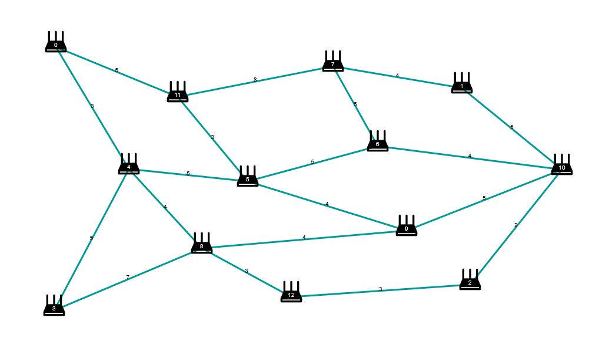

# dvroutingsim: A Distance Vector Routing Simulation
[dvroutingsim](http://dvroutingsim.surge.sh) is an easy to use [Distance Vector Routing](https://en.wikipedia.org/wiki/Distance-vector_routing_protocol?useskin=vector) simulation that runs in your browser!

## Basic Controls
- **Single Left Click:** Create/Select a router
- **Left Click and Drag:** Move router around
- **Double Left Click:** Open full distance vector table in modal
- **Right Click:** Preview of full distance vector table
- **Middle Click:** Middle click a router to highlight it, middle click another router to connect it to the highlighted router
	- To delete a link, *edit its weight to zero*
- **Delete Key:** Delete selected router
Click the question mark icon on the top right corner for a quick reference of the mouse controls.
## Router States
<p align="center">
	
</p>

A **selected** router, will be indicated by a blue circle
A **highlighted** router, will be indicated by a thick red circle
## Toolbar
At the bottom of the page there a toolbar provides conveniences as well as allow control over the simulation.

The buttons are:
- **Upload:** Uploads a JSON file representing a network
	- JSON file must be obtained from the app itself
- **Download:** Downloads the network as a JSON file, maintaining the current network state (more in [[#Static Representation]]).
- **Save:** Saves the current network (with a name) such that it appears in the top dropdown
- **Reset:** Reset the distance vectors of all routers
- **Clear:** Remove all routers
- **Forward:** Move the simulation one step forward (more in [[#Simulation]])
- **FForward (Fast Forward):** Perform Bellman-Ford algorithm to calculate the final distance vector for all routers
## Simulation
### Main classes
The app contains the following main classes (simplified)
```Typescript
class DistanceElement {
	//This represent one element in a distance vector
    dest: Router;
    next: Router;
    cost: number;
}

class Router {
    id: number;
    distVec: DistanceElement[] = [];
    vertex: Vertex; //Contains data for drawing the router
    dvQ: DistanceElement[][] = []; //distance vectors of neighbours
    C: DistanceElement[] = []; //distance to neighbours
    send(links: Link[]) {
	    //sends distance vector to neighbours and ask them to recalculate accordingly
    }
    discover(links: Link[]) {
	    //find out distances to neighbours
    }
    recalc(from: number) {
	    //recalculate distance vector with information from "from" <-- this is an optimization
	    //computes the Bellman-Ford equation
    }
}

class Link {
	routers: Router[]; 
	//array used to represent the undirectedness of each link
	cost: number;
}
```
The forward button calls the send method on each Router object.
```typescript
const forward = () => {
	routers.forEach((x) => x.send());
}
```
The `send(links: Link[])` method is as follows (pseudo-code and simplified)
```typescript
class Router {
	//field declaration
	discover() {
		this.neighbours.forEach(x => {
			C[x.id] = DistanceElement to x;
		})
	}
	send(){
		this.neighbours.forEach(x => {
			x.discover();
			x.dvQ[this.id] = this.distVec.clone()
			x.recalc(this.id);
		})
	}
	recalc(from: number){
		for (let i = 0; i < distVec.length; i++){
			this.distVec[i] = min(this.distVec[i], this.C[from] + this.dvQ[from][i])
		}
	}
}
```
As such, in each forward step,
- all routers forward information to their neighbours
- all routers process the incoming information $n$ times (where $n$ is the number of neighbours)
## Static Representation
### Download
The **download** method works by converting the network (consisting of a links array and a routers array) into a POJO, which is then saved into a downloadable JSON file. All object references in `class DistanceElement {...}` and `class Link {...}` is "rasterized" into static `id` references. While the distance vectors are discarded completely.
To keep track of the state of the network such that we can regenerate the distance vectors later, a counter `nForward` keeps track of the number of forward steps that the user had taken. `nForward` is set to -1 to indicate that the user used fast-forward. This number if saved alongside the JSON
### Upload
The upload method reconstructs the network from the JSON POJO, it also reconnects all the relevant object references using the static `id` references.
Then, the `nForward` number is inspected in order to restore the previous state of the network
```typescript
if (nForward > 0)
	call forward() n times
else 
	call fforward() //Bellman-Ford's algorithm
```
## Sample Networks
### Count to Infinity
Following this example set-up
<p align="center">
	
</p>

A sample network is given in the simulation called "Count to Infinity" which is converged at the point before the disastrous weight change that sets off the count to infinity.
<p align="center">
	
</p>

### The Fish
Its just a large network that would necessitate the use of the double-click distance vector table inspection.

## Responsive Design
Each graph is scaled relative to the original window size with which it is constructed. This prevents networks constructed on larger windows appearing to have been cut off on smaller windows, and prevents networks constructed on smaller windows appearing to have been bunched up to one side on larger windows.
## Setup Guide
Aside from the web-hosted version, you can also run [dvroutingsim](http://dvroutingsim.surge.sh) locally.
